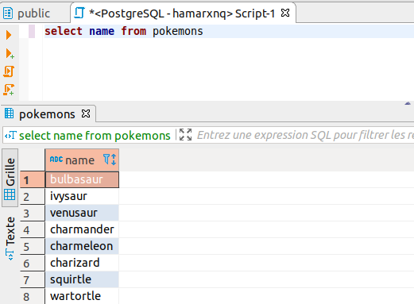

# WorkshopSQL

# Pour bien commencer

Nous allons utiliser une base de données en PostgreSQL.

Pour plus de facilité, nous te recommandons d'utiliser http://www.elephantSQL.com

C'est un service de base de données en ligne super simple qui nécessite simplement de t'inscrire.

Sinon, mais c'est plus long et compliqué :

Utilise PostgreSQL avec Docker grâce à ce lien:
https://docs.docker.com/engine/examples/postgresql_service/

Tu dois désormais être en possession de plusieurs informations pour continuer :

#### Informations de connexion

- Nom de l'hôte / Hostname
- Base de données / Database
- Nom d'utilisateur / User
- Mot de passe / Password

# Gérer sa base de données.

Pour afficher le contenu et faire des requêtes, nous te proposons un super outil:

- Gratuit
- Multi OS (Mac, Linux et Windows)
- Multi databases (parmi les plus populaires: MySQL, PostgreSQL, Oracle, SQL Server, SQLite...)

Qui te permettra de gérer toutes tes futures bases de données depuis une même interface.

C'est par ici : https://dbeaver.io/

Une fois installé et lancé, un assistant t'aidera à configurer la connexion vers ta base de données.

# Et Maintenant, on parle Pokémons (Gotta store 'em all)

Le contenu à importer dans ta base de données se trouve [là](./exportsFiles/pokemons_Database.sql)

Tu possèdes désormais une base de données contenant:

- Une table contenant les Pokémons des deux premières générations
- Une table contenant les types de Pokémons
- Une table contenant les Régions (Kanto et Johto)
- Une table contenant les relations entres les types et les pokemons

### Ressources pour résoudre les énigmes :

* [postgresqltutorial](http://www.postgresqltutorial.com/)
* [postgreSQL](https://www.postgresql.org/)
* [postgreSQL sur DevDoc.io](https://devdocs.io/postgresql~11/)

# La liste des "énigmes" à résoudre (ou des requêtes si tu préfères rester sérieux).

Nous allons te donner une série d'instructions, en français, que tu dois convertir en SQL afin d'obtenir un résultat:

## Un exemple pour commencer

Récupère la liste des noms des pokémons (Tips: La colonne s'intitule 'name')

#### Résultat:

Dans cette fenêtre, tu as donc la requête (en haut) et le résultat (en bas). Pour chaque énigme, tu devras obtenir le même genre de fenêtre.

### Énigmes

Récupère les id ainsi que les noms des pokémons dont le poids est supérieur à 2000.

| id  | name      |
| --- | --------- |
| 76  | golem     |
| 95  | onix      |
| 130 | gyarados  |
| 131 | lapras    |
| 143 | snorlax   |
| 149 | dragonite |
| 208 | steelix   |
| 226 | mantine   |
| 248 | tyranitar |
| 249 | lugia     |

Récupère les id, les noms, ainsi que la taille des pokémons dont le poids est inférieur ou égal à 20 dans l'ordre croissant par taille.

| id  | name       | height |
| --- | ---------- | ------ |
| 50  | diglett    | 2      |
| 177 | natu       | 2      |
| 16  | pidgey     | 3      |
| 21  | spearow    | 3      |
| 172 | pichu      | 3      |
| 174 | igglybuff  | 3      |
| 175 | togepi     | 3      |
| 191 | sunkern    | 3      |
| 187 | hoppip     | 4      |
| 109 | koffing    | 6      |
| 188 | skiploom   | 6      |
| 200 | misdreavus | 7      |
| 92  | gastly     | 13     |
| 93  | haunter    | 16     |

Récupère les noms des 3 pokémons les plus lourds

| name    |
| ------- |
| snorlax |
| steelix |
| golem   |

Récupère les noms des pokemons avec leur types (Tips: On appelle ça une double jointure)

| name       | type   |
| ---------- | ------ |
| bulbasaur  | poison |
| bulbasaur  | grass  |
| ivysaur    | poison |
| ivysaur    | grass  |
| venusaur   | poison |
| venusaur   | grass  |
| charmander | fire   |
| charmeleon | fire   |
| charizard  | flying |
| charizard  | fire   |
| ...        | ...    |

Récupère tous les pokémons originaires de Johto dont le nom termine par la lettre u

| name     | type  |
| -------- | ----- |
| chinchou | johto |
| pichu    | johto |
| natu     | johto |
| xatu     | johto |
| raikou   | johto |

Affiche le nombre de pokémons dans chaque région

| Sum | name  |
| --- | ----- |
| 151 | kanto |
| 200 | johto |

Quel expérience vais-je gagner si je bats un magneton, un tauros et un kabuto ?

| Total |
| ----- |
| 406   |
